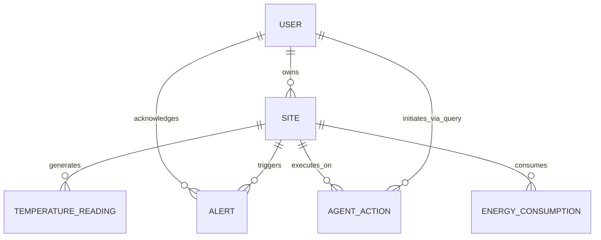
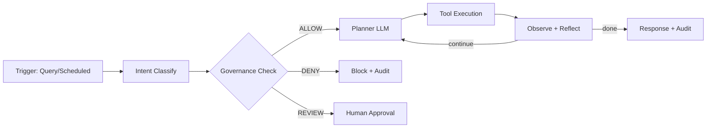

# OmniTherm AI - Documentación de Arquitectura Backend

> Plataforma centralizada que actúa como el "cerebro térmico" de una empresa, unificando predicción de riesgos, eficiencia energética y automatización en un **Agente Autónomo de IA**.

## Índice de Documentación

### Arquitectura

| Documento | Descripción |
|-----------|-------------|
| [01 - Contexto del Sistema](architecture/01-system-context.md) | Visión general, actores, sistemas externos, flujos, C4 Level 1 |
| [02 - Diagrama ER (Notación Chen)](architecture/02-er-diagram-chen.md) | Modelo de datos completo, diccionario de datos, migración Alembic |
| [03 - Especificación API](architecture/03-api-specification.md) | Endpoints REST, schemas Pydantic, manejo de errores |
| [04 - Arquitectura del Agente IA](architecture/04-agent-architecture.md) | Google ADK, tools, governance, prompts, testing |
| [05 - Integración FortyGuard](architecture/05-fortyguard-integration.md) | Cliente async, endpoints, scheduler, datos prueba |
| [06 - Integración RAG](architecture/06-rag-integration.md) | Adaptación del trabajo de Lilly, evita código muerto |
| [07 - Despliegue](architecture/07-deployment.md) | Docker, CI/CD, variables entorno, seguridad |

### Decisiones

| Documento | Descripción |
|-----------|-------------|
| [ADR-001](adr/ADR-001-backend-architecture.md) | Arquitectura del backend (modular monolith + ADK) |

---

## Resumen de Stack

| Capa | Tecnología |
|------|------------|
| API | FastAPI + Pydantic v2 |
| DB | PostgreSQL + SQLAlchemy 2.0 (async) + Alembic |
| Agente IA | Google ADK + Gemini 2.0 Flash |
| Conocimiento | ChromaDB (RAG, reutilizando trabajo de Lilly) |
| Integración | FortyGuard Temperature API (async submit+poll) |
| Auth | JWT + bcrypt |
| Scheduler | APScheduler |
| Deploy | Docker + Railway/Render |

---

## Los 3 Pilares del Sistema

```
┌─────────────────────────────────────────────────────────────┐
│                                                             │
│   1. PROTECCIÓN        2. EFICIENCIA       3. AGENTE        │
│      INDUSTRIAL          DE EDIFICIOS        AUTÓNOMO       │
│                                                             │
│   Logistics Heat      Digital twin         Orquesta los     │
│   Risk                energético           dos pilares      │
│   Worker Safety       HVAC optimization    Alert Automation │
│                                                             │
│   ─────────────────────────────────────────────────────     │
│        Todos consumen FortyGuard Temperature API®          │
│                                                             │
└─────────────────────────────────────────────────────────────┘
```

---

## Diagramas Clave

### ER (Notación Chen) - Versión Simplificada



### Loop del Agente



---

## Estado del Proyecto

- [x] Documentación de arquitectura completa
- [x] Diagrama ER notación Chen
- [x] Especificación API
- [x] Arquitectura agente ADK + governance
- [x] Integración FortyGuard
- [x] Adaptación RAG de Lilly
- [ ] Implementación de código
- [ ] Conexión frontend
- [ ] Deploy

---

## Referencias Externas

- [FortyGuard API Docs](https://docs-api.fortyguard.com)
- [FortyGuard Quickstart (GitHub)](https://github.com/FortyGuard-Tech/temperature-api-quickstart)
- [Google ADK (GitHub)](https://github.com/google/adk-python)
- [Google ADK Docs](https://google.github.io/adk-docs/)
- [FortyGuard Pricing](https://www.fortyguard.com/api-pricing)
