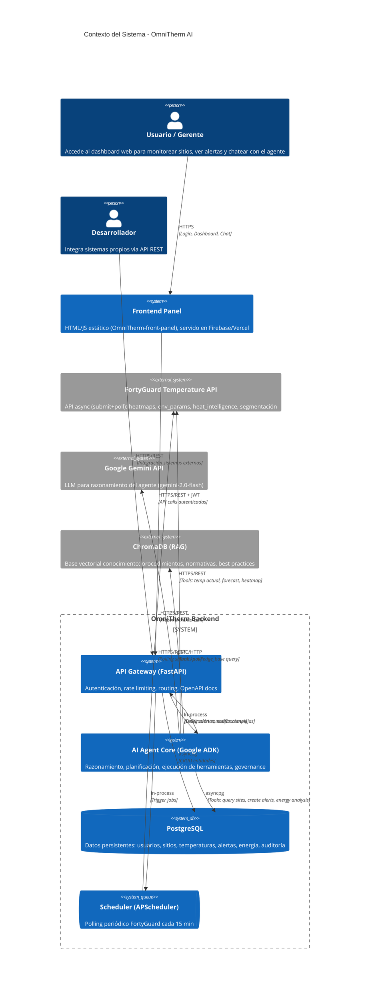

# Contexto del Sistema - OmniTherm AI

## Visión General

OmniTherm AI es una plataforma centralizada que actúa como el "cerebro térmico" de una empresa. Unifica predicción de riesgos, eficiencia energética y automatización en un **Agente Autónomo de IA** que consume datos climáticos hiperlocales (FortyGuard Temperature API®), cruza la información con la operativa de la empresa y toma decisiones en tiempo real.

## Actores

| Actor | Descripción | Interacciones |
|-------|-------------|---------------|
| **Usuario/Gerente** | Personal de operaciones, facility managers, directivos | Dashboard web, chat con agente, alertas |
| **Desarrollador** | Integraciones con sistemas propios (ERP, BMS, IoT) | API REST documentada |
| **Scheduler (Sistema)** | Proceso automático periódico | Polling FortyGuard, evaluación umbrales, trigger agente |

## Sistemas Externos



## Flujos de Datos Principales

### 1. Monitoreo Automático (Scheduled)
```
Scheduler (15 min) → FortyGuard API (submit+poll) → PostgreSQL (temperature_readings) 
→ Evaluar umbrales → Si excede: Agent.process_heat_alert() → Alertas + Notificaciones
```

### 2. Consulta Usuario (On-Demand)
```
Frontend → API Gateway → Agent.chat() → Tools (FortyGuard, DB, RAG) → Respuesta estructurada
```

### 3. Análisis Eficiencia (Bajo demanda)
```
Usuario/API → Agent.analyze_energy_waste() → DB (energy_consumption + temperature_readings) 
→ LLM reasoning → Recomendaciones HVAC + ROI estimado
```

## Límites del Sistema

| Límite | Detalle |
|--------|---------|
| **Geográfico** | FortyGuard API: Solo Estados Unidos (coordenadas fuera dan error) |
| **Temporal** | Datos históricos: 2021 → hoy. No futuro. |
| **Plan API** | Basic: 10 mi² heatmap, 1M créditos/mes. Premium: 50 mi², 5M créditos, segmentación, heat_intelligence |
| **Concurrencia** | Polling máx 3s intervalo, timeout 5 min por task |
| **Agente** | Máx 15 llamadas tool por request, rate limit por política governance |

## Decisiones Arquitectónicas Clave

| Decisión | Opción | Rationale |
|----------|--------|-----------|
| **Estilo** | Modular Monolith | Simple para hackathon, deploy single container, separación limpia por capas |
| **Agent Framework** | Google ADK | Gratis (Apache 2.0), governance nativo, multi-agent, Gemini nativo |
| **FortyGuard** | Polling 15min + webhook-ready | Sin URL pública necesaria para hackathon, extensible a webhooks |
| **Auth** | JWT stateless | Funciona con frontend estático sin sesiones server-side |
| **Real-time** | Polling frontend 30s | Evita WebSockets, simple para MVP |
| **DB** | PostgreSQL + JSONB | Relacional para integridad, JSONB para metadata flexible (sitios, alertas, acciones) |