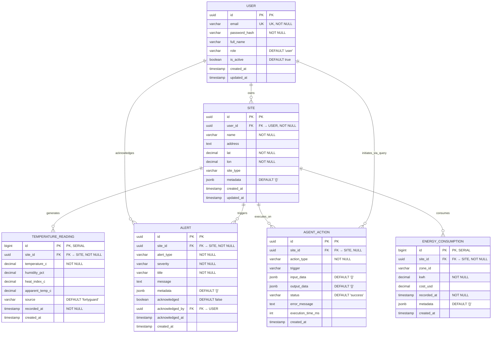
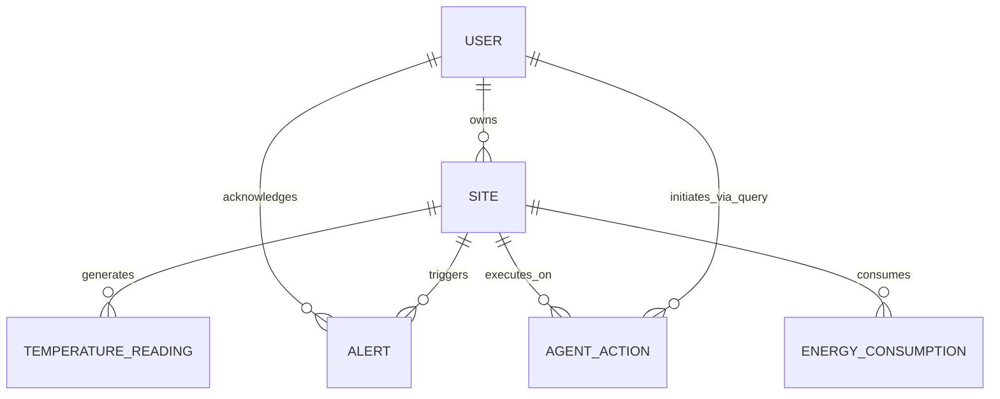

# Diagrama Entidad-Relación (Notación Chen)

## Diagrama Mermaid (Renderizable en GitHub/GitLab/Notion/Obsidian)



## Equivalencia Notación Chen ↔ Mermaid

| Elemento Chen | Representación Mermaid | Descripción |
|---------------|------------------------|-------------|
| ▭ Rectángulo | `ENTITY { ... }` | Entidad fuerte (identidad propia) |
| ▭ Rectángulo doble | No usado | Entidad débil (identidad relativa) |
| ◆ Rombo | `--` (línea con cardinalidad) | Relación entre entidades |
| ◦ Círculo | Atributo dentro de `{}` | Atributo simple |
| ◦ Círculo subrayado | `PK` | Clave primaria |
| ◦ Círculo punteado | `FK` | Clave foránea |
| `1` / `N` / `M` | `||--o{` / `}o--o{` | Cardinalidad (1:N, M:N) |

## Diccionario de Datos

### USER
| Columna | Tipo | Constraints | Descripción |
|---------|------|-------------|-------------|
| id | UUID | PK, DEFAULT gen_random_uuid() | Identificador único |
| email | VARCHAR(255) | UK, NOT NULL | Email único, login |
| password_hash | VARCHAR(255) | NOT NULL | bcrypt hash |
| full_name | VARCHAR(255) | | Nombre completo |
| role | VARCHAR(50) | DEFAULT 'user' | 'admin', 'user', 'viewer' |
| is_active | BOOLEAN | DEFAULT true | Soft delete |
| created_at | TIMESTAMPTZ | DEFAULT now() | Auditoría |
| updated_at | TIMESTAMPTZ | DEFAULT now() | Auditoría |

### SITE
| Columna | Tipo | Constraints | Descripción |
|---------|------|-------------|-------------|
| id | UUID | PK, DEFAULT gen_random_uuid() | Identificador único |
| user_id | UUID | FK → USER, NOT NULL | Propietario |
| name | VARCHAR(255) | NOT NULL | Nombre sitio |
| address | TEXT | | Dirección física |
| lat | DECIMAL(10,8) | NOT NULL | Latitud (FortyGuard) |
| lon | DECIMAL(11,8) | NOT NULL | Longitud (FortyGuard) |
| site_type | VARCHAR(50) | | 'warehouse', 'office', 'datacenter', 'factory' |
| metadata | JSONB | DEFAULT '{}' | Config flexible: HVAC, umbrales, zonas |
| created_at | TIMESTAMPTZ | DEFAULT now() | |
| updated_at | TIMESTAMPTZ | DEFAULT now() | |

**metadata JSONB ejemplo:**
```json
{
  "heat_threshold_c": 35.0,
  "hvac_zones": ["zone_a", "zone_b"],
  "hvac_config": {"mode": "auto", "setpoint_c": 22},
  "operating_hours": {"start": "06:00", "end": "22:00"},
  "worker_shifts": ["06:00-14:00", "14:00-22:00", "22:00-06:00"]
}
```

### TEMPERATURE_READING
| Columna | Tipo | Constraints | Descripción |
|---------|------|-------------|-------------|
| id | BIGINT | PK, SERIAL | Auto-increment (alta escritura) |
| site_id | UUID | FK → SITE, NOT NULL | Sitio origen |
| temperature_c | DECIMAL(5,2) | NOT NULL | Temperatura °C |
| humidity_pct | DECIMAL(5,2) | | Humedad % |
| heat_index_c | DECIMAL(5,2) | | Índice calor °C |
| apparent_temp_c | DECIMAL(5,2) | | Sensación térmica real °C |
| source | VARCHAR(50) | DEFAULT 'fortyguard' | 'fortyguard', 'sensor', 'manual' |
| recorded_at | TIMESTAMPTZ | NOT NULL | Timestamp medición |
| created_at | TIMESTAMPTZ | DEFAULT now() | Inserción BD |

**Índices:**
- `idx_temp_site_time (site_id, recorded_at DESC)` — Queries últimas lecturas por sitio
- `idx_temp_recorded (recorded_at DESC)` — Limpieza/retención por tiempo

### ALERT
| Columna | Tipo | Constraints | Descripción |
|---------|------|-------------|-------------|
| id | UUID | PK, DEFAULT gen_random_uuid() | |
| site_id | UUID | FK → SITE, NOT NULL | |
| alert_type | VARCHAR(50) | NOT NULL | 'heat_risk', 'energy_waste', 'worker_safety', 'anomaly' |
| severity | VARCHAR(20) | NOT NULL | 'info', 'warning', 'critical' |
| title | VARCHAR(255) | NOT NULL | Título corto |
| message | TEXT | | Detalle |
| metadata | JSONB | DEFAULT '{}' | temp_value, threshold, recommended_action |
| acknowledged | BOOLEAN | DEFAULT false | |
| acknowledged_by | UUID | FK → USER | Quién aceptó |
| acknowledged_at | TIMESTAMPTZ | | Cuándo |
| created_at | TIMESTAMPTZ | DEFAULT now() | |

**Índices:**
- `idx_alerts_site_time (site_id, created_at DESC)`
- `idx_alerts_unacked (acknowledged) WHERE acknowledged = false` — Partial index alertas pendientes

### AGENT_ACTION (Auditoría completa del agente)
| Columna | Tipo | Constraints | Descripción |
|---------|------|-------------|-------------|
| id | UUID | PK, DEFAULT gen_random_uuid() | |
| site_id | UUID | FK → SITE, NULL | NULL si acción global |
| action_type | VARCHAR(50) | NOT NULL | 'alert_sent', 'hvac_adjusted', 'notification_sent', 'report_generated', 'query_answered' |
| trigger | VARCHAR(100) | | 'temperature_threshold', 'energy_anomaly', 'user_query', 'scheduled' |
| input_data | JSONB | DEFAULT '{}' | Parámetros entrada al tool |
| output_data | JSONB | DEFAULT '{}' | Resultado tool |
| status | VARCHAR(20) | DEFAULT 'success' | 'success', 'failed', 'pending_approval' |
| error_message | TEXT | | Si failed |
| execution_time_ms | INTEGER | | Latencia tool |
| created_at | TIMESTAMPTZ | DEFAULT now() | |

**Índices:**
- `idx_agent_actions_site_time (site_id, created_at DESC)`

### ENERGY_CONSUMPTION
| Columna | Tipo | Constraints | Descripción |
|---------|------|-------------|-------------|
| id | BIGINT | PK, SERIAL | Alta escritura |
| site_id | UUID | FK → SITE, NOT NULL | |
| zone_id | VARCHAR(100) | | 'floor_1_zone_a', 'datacenter_rack_3' |
| kwh | DECIMAL(12,4) | NOT NULL | Consumo kWh |
| cost_usd | DECIMAL(12,4) | | Costo USD |
| recorded_at | TIMESTAMPTZ | NOT NULL | Periodo medición |
| metadata | JSONB | DEFAULT '{}' | equipment_type, hvac_mode, etc. |
| created_at | TIMESTAMPTZ | DEFAULT now() | |

**Índices:**
- `idx_energy_site_time (site_id, recorded_at DESC)`

## Decisiones de Modelado

### UUID vs BIGSERIAL
| Tabla | PK | Por qué |
|-------|-----|---------|
| USER, SITE, ALERT, AGENT_ACTION | UUID | Distribuido, seguro, no expone cardinalidad |
| TEMPERATURE_READING, ENERGY_CONSUMPTION | BIGSERIAL | Alta frecuencia escritura, rendimiento, orden natural |

### JSONB para Metadata
- **Flexibilidad**: Cada sitio tiene config distinta (HVAC, umbrales, turnos)
- **Evolución**: Agregar campos sin migraciones
- **Query**: `metadata->>'heat_threshold_c'` + índices GIN si necesario

### TIMESTAMPTZ
- Todo en UTC internamente
- Conversión a zona horaria usuario solo en presentación

### Partial Index en ALERT
```sql
CREATE INDEX idx_alerts_unacked ON alerts(acknowledged) WHERE acknowledged = false;
```
Optimiza `SELECT * FROM alerts WHERE acknowledged = false` (dashboard alertas activas).

## Migración Inicial (Alembic)

```python
# alembic/versions/001_initial_schema.py
"""Initial schema

Revision ID: 001
Revises: 
Create Date: 2026-08-20
"""
from alembic import op
import sqlalchemy as sa
from sqlalchemy.dialects import postgresql

revision = '001'
down_revision = None
branch_labels = None
depends_on = None

def upgrade():
    # Extensiones
    op.execute('CREATE EXTENSION IF NOT EXISTS "uuid-ossp"')
    op.execute('CREATE EXTENSION IF NOT EXISTS "pgcrypto"')
    
    # USERS
    op.create_table(
        'users',
        sa.Column('id', postgresql.UUID(as_uuid=True), primary_key=True, server_default=sa.text('gen_random_uuid()')),
        sa.Column('email', sa.String(255), nullable=False, unique=True),
        sa.Column('password_hash', sa.String(255), nullable=False),
        sa.Column('full_name', sa.String(255)),
        sa.Column('role', sa.String(50), nullable=False, server_default='user'),
        sa.Column('is_active', sa.Boolean, nullable=False, server_default=sa.true()),
        sa.Column('created_at', sa.DateTime(timezone=True), server_default=sa.func.now()),
        sa.Column('updated_at', sa.DateTime(timezone=True), server_default=sa.func.now()),
    )
    
    # SITES
    op.create_table(
        'sites',
        sa.Column('id', postgresql.UUID(as_uuid=True), primary_key=True, server_default=sa.text('gen_random_uuid()')),
        sa.Column('user_id', postgresql.UUID(as_uuid=True), sa.ForeignKey('users.id', ondelete='CASCADE'), nullable=False),
        sa.Column('name', sa.String(255), nullable=False),
        sa.Column('address', sa.Text),
        sa.Column('lat', sa.Numeric(10, 8), nullable=False),
        sa.Column('lon', sa.Numeric(11, 8), nullable=False),
        sa.Column('site_type', sa.String(50)),
        sa.Column('metadata', postgresql.JSONB, nullable=False, server_default=sa.text("'{}'::jsonb")),
        sa.Column('created_at', sa.DateTime(timezone=True), server_default=sa.func.now()),
        sa.Column('updated_at', sa.DateTime(timezone=True), server_default=sa.func.now()),
    )
    op.create_index('idx_sites_user', 'sites', ['user_id'])
    
    # TEMPERATURE_READINGS
    op.create_table(
        'temperature_readings',
        sa.Column('id', sa.BigInteger, primary_key=True, autoincrement=True),
        sa.Column('site_id', postgresql.UUID(as_uuid=True), sa.ForeignKey('sites.id', ondelete='CASCADE'), nullable=False),
        sa.Column('temperature_c', sa.Numeric(5, 2), nullable=False),
        sa.Column('humidity_pct', sa.Numeric(5, 2)),
        sa.Column('heat_index_c', sa.Numeric(5, 2)),
        sa.Column('apparent_temp_c', sa.Numeric(5, 2)),
        sa.Column('source', sa.String(50), nullable=False, server_default='fortyguard'),
        sa.Column('recorded_at', sa.DateTime(timezone=True), nullable=False),
        sa.Column('created_at', sa.DateTime(timezone=True), server_default=sa.func.now()),
    )
    op.create_index('idx_temp_site_time', 'temperature_readings', ['site_id', sa.text('recorded_at DESC')])
    op.create_index('idx_temp_recorded', 'temperature_readings', [sa.text('recorded_at DESC')])
    
    # ALERTS
    op.create_table(
        'alerts',
        sa.Column('id', postgresql.UUID(as_uuid=True), primary_key=True, server_default=sa.text('gen_random_uuid()')),
        sa.Column('site_id', postgresql.UUID(as_uuid=True), sa.ForeignKey('sites.id', ondelete='CASCADE'), nullable=False),
        sa.Column('alert_type', sa.String(50), nullable=False),
        sa.Column('severity', sa.String(20), nullable=False),
        sa.Column('title', sa.String(255), nullable=False),
        sa.Column('message', sa.Text),
        sa.Column('metadata', postgresql.JSONB, nullable=False, server_default=sa.text("'{}'::jsonb")),
        sa.Column('acknowledged', sa.Boolean, nullable=False, server_default=sa.false()),
        sa.Column('acknowledged_by', postgresql.UUID(as_uuid=True), sa.ForeignKey('users.id')),
        sa.Column('acknowledged_at', sa.DateTime(timezone=True)),
        sa.Column('created_at', sa.DateTime(timezone=True), server_default=sa.func.now()),
    )
    op.create_index('idx_alerts_site_time', 'alerts', ['site_id', sa.text('created_at DESC')])
    op.execute('CREATE INDEX idx_alerts_unacked ON alerts(acknowledged) WHERE acknowledged = false')
    
    # AGENT_ACTIONS
    op.create_table(
        'agent_actions',
        sa.Column('id', postgresql.UUID(as_uuid=True), primary_key=True, server_default=sa.text('gen_random_uuid()')),
        sa.Column('site_id', postgresql.UUID(as_uuid=True), sa.ForeignKey('sites.id', ondelete='SET NULL')),
        sa.Column('action_type', sa.String(50), nullable=False),
        sa.Column('trigger', sa.String(100)),
        sa.Column('input_data', postgresql.JSONB, nullable=False, server_default=sa.text("'{}'::jsonb")),
        sa.Column('output_data', postgresql.JSONB, nullable=False, server_default=sa.text("'{}'::jsonb")),
        sa.Column('status', sa.String(20), nullable=False, server_default='success'),
        sa.Column('error_message', sa.Text),
        sa.Column('execution_time_ms', sa.Integer),
        sa.Column('created_at', sa.DateTime(timezone=True), server_default=sa.func.now()),
    )
    op.create_index('idx_agent_actions_site_time', 'agent_actions', ['site_id', sa.text('created_at DESC')])
    
    # ENERGY_CONSUMPTION
    op.create_table(
        'energy_consumption',
        sa.Column('id', sa.BigInteger, primary_key=True, autoincrement=True),
        sa.Column('site_id', postgresql.UUID(as_uuid=True), sa.ForeignKey('sites.id', ondelete='CASCADE'), nullable=False),
        sa.Column('zone_id', sa.String(100)),
        sa.Column('kwh', sa.Numeric(12, 4), nullable=False),
        sa.Column('cost_usd', sa.Numeric(12, 4)),
        sa.Column('recorded_at', sa.DateTime(timezone=True), nullable=False),
        sa.Column('metadata', postgresql.JSONB, nullable=False, server_default=sa.text("'{}'::jsonb")),
        sa.Column('created_at', sa.DateTime(timezone=True), server_default=sa.func.now()),
    )
    op.create_index('idx_energy_site_time', 'energy_consumption', ['site_id', sa.text('recorded_at DESC')])

def downgrade():
    op.drop_table('energy_consumption')
    op.drop_table('agent_actions')
    op.drop_table('alerts')
    op.drop_table('temperature_readings')
    op.drop_table('sites')
    op.drop_table('users')
```

## Diagrama Mermaid - Versión Simplificada (Solo Entidades)

