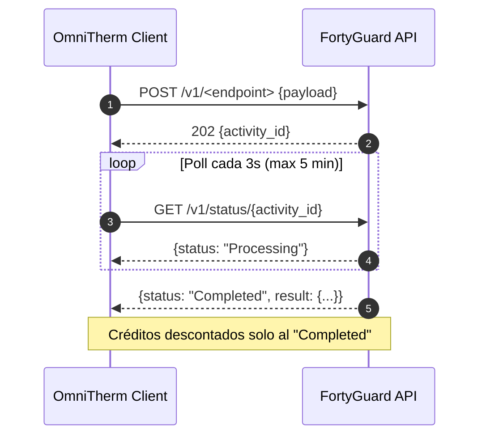

# Integración FortyGuard Temperature API®

## Visión General

FortyGuard Temperature API es una API **asíncrona** (submit → poll) que provee inteligencia térmica hiperlocal basada en **Large Temperature Models (LTMs)**. Todos los endpoints devuelven JSON/GeoJSON.

## Datos Clave

| Aspecto | Valor |
|---------|-------|
| **Base URL** | `https://api.fortyguard.com` |
| **Dev URL** | `https://tos-enterprise-api.dev.app.fortyguard.com` |
| **Auth** | Header `api-key: <YOUR_API_KEY>` (sin OAuth) |
| **Cobertura** | Solo EE. UU. |
| **Rango fechas** | 2021-01-01 → hoy (sin futuro) |
| **Unidades** | °C nativo (convertir a °F solo display) |
| **Coordenadas GeoJSON** | `[longitude, latitude]` |
| **Docs** | https://docs-api.fortyguard.com |
| **SDK Python** | https://github.com/FortyGuard-Tech/temperature-api-quickstart |

## Planes y Créditos

| Plan | Precio | Créditos/mes | Heatmap | Premium Endpoints |
|------|--------|--------------|---------|-------------------|
| **Basic** | $79/mes | 1,000,000 | hasta 10 mi² | — |
| **Pro** | $289/mes | 5,000,000 | hasta 50 mi² | Satellite, StreetView, Heat Intelligence |

> **Créditos solo se descuentan en status `Completed`.** Tasks fallidos son gratis.

---

## Endpoints Disponibles

| Endpoint | Método | Plan | Descripción |
|----------|--------|------|-------------|
| `/v1/heatmap` | POST | Both | Mapa térmico sobre polígono AOI |
| `/v1/env_params` | POST | Both | Heat index, AQI, irradiación en punto |
| `/v1/satellite` | POST | Premium | Segmentación cobertura suelo |
| `/v1/streetview` | POST | Premium | Segmentación vista calle |
| `/v1/heat_intelligence` | POST | Premium | Reporte PDF multidimensional |
| `/v1/system/fetch-api-key-custom-usage` | POST | Both | Uso créditos |
| `/v1/status/{activity_id}` | GET | Both | Status de task async |

---

## Patrón Async: Submit + Poll



### Tabla de Status

| Response | Significado |
|----------|-------------|
| `400/422` | Request inválido |
| `401` | API key inválida |
| `403` | Plan insuficiente |
| `404` | Activity no encontrado (o no listo aún) |
| `429` | Rate limit |
| `500` | Error server |
| `Processing` | Continuar polling |
| `Completed` | Recuperar resultado |
| `Failed` | Detener, registrar activity_id |

---

## Cliente Python (Integración)

```python
# app/integrations/fortyguard.py
import asyncio
import httpx
from dataclasses import dataclass
from typing import Optional, List, Dict, Any

@dataclass
class TemperatureReading:
    temperature_c: float
    humidity_pct: Optional[float]
    heat_index_c: Optional[float]
    apparent_temp_c: Optional[float]
    recorded_at: str
    tile_id: Optional[int] = None

@dataclass
class TemperatureForecast:
    timestamp: str
    temperature_c: float
    humidity_pct: Optional[float]
    heat_index_c: Optional[float]

class FortyGuardClient:
    def __init__(
        self,
        api_key: str,
        base_url: str = "https://api.fortyguard.com",
        poll_interval: int = 3,
        max_wait: int = 300,
    ):
        self.api_key = api_key
        self.base_url = base_url
        self.poll_interval = poll_interval
        self.max_wait = max_wait
        self.client = httpx.AsyncClient(timeout=60.0)
        self.headers = {
            "api-key": self.api_key,
            "Content-Type": "application/json",
        }

    async def _submit_task(self, endpoint: str, payload: Dict[str, Any]) -> str:
        """Submit task asíncrono, retorna activity_id."""
        response = await self.client.post(
            f"{self.base_url}{endpoint}",
            json=payload,
            headers=self.headers,
        )
        response.raise_for_status()
        return response.json()["activity_id"]

    async def _poll_status(self, activity_id: str) -> Dict[str, Any]:
        """Poll hasta Completed/Failed con timeout."""
        elapsed = 0
        while elapsed < self.max_wait:
            response = await self.client.get(
                f"{self.base_url}/v1/status/{activity_id}",
                headers=self.headers,
            )
            response.raise_for_status()
            data = response.json()
            status = data.get("status", "").lower()

            if status in ("completed", "succeeded"):
                return data.get("result", {})
            if status in ("failed", "error"):
                raise FortyGuardTaskFailed(f"Task {activity_id} failed: {data}")

            await asyncio.sleep(self.poll_interval)
            elapsed += self.poll_interval

        raise FortyGuardTaskTimeout(f"Task {activity_id} timeout after {self.max_wait}s")

    async def submit_and_wait(self, endpoint: str, payload: Dict[str, Any]) -> Dict[str, Any]:
        """Helper: submit + poll en un solo método."""
        activity_id = await self._submit_task(endpoint, payload)
        return await self._poll_status(activity_id)

    # ---- Endpoints específicos ----

    async def get_heatmap(
        self,
        polygon_aoi: Dict[str, Any],
        start_date: str,
        filter_type: int = 3,
        granularity: int = 100,
        analytic_type: str = "tcm",
        end_date: Optional[str] = None,
        threshold: Optional[float] = None,
        direction: Optional[str] = None,
    ) -> Dict[str, Any]:
        """Mapa térmico sobre AOI.
        
        filter_type: 1=single hour, 2=range hours, 3=single day, 4=range days
        granularity: 60, 80, 100 (metros)
        analytic_type: tcm, time_of_measure, exceedance, persistence
        """
        payload = {
            "polygon_aoi": polygon_aoi,
            "start_date": start_date,
            "filter_type": filter_type,
            "granularity": granularity,
            "analytic_type": analytic_type,
        }
        if end_date:
            payload["end_date"] = end_date
        if threshold is not None:
            payload["threshold"] = threshold
        if direction:
            payload["direction"] = direction

        return await self.submit_and_wait("/v1/heatmap", payload)

    async def get_env_params(
        self,
        lat: float,
        lon: float,
        start_date: str,
        filter_type: int = 3,
    ) -> TemperatureReading:
        """Parámetros ambientales en punto: heat index, AQI, irradiación."""
        result = await self.submit_and_wait("/v1/env_params", {
            "latitude": lat,
            "longitude": lon,
            "start_date": start_date,
            "filter_type": filter_type,
        })
        return self._parse_env_params(result)

    async def get_exceedance_map(
        self,
        polygon_aoi: Dict[str, Any],
        start_date: str,
        end_date: str,
        threshold_c: float = 35.0,
        direction: str = "above",
    ) -> Dict[str, Any]:
        """Mapa de horas excediendo umbral (ideal para risk assessment)."""
        return await self.get_heatmap(
            polygon_aoi=polygon_aoi,
            start_date=start_date,
            end_date=end_date,
            filter_type=4,
            analytic_type="exceedance",
            threshold=threshold_c,
            direction=direction,
        )

    async def get_heat_intelligence_report(
        self,
        polygon_aoi: Dict[str, Any],
        start_date: str,
    ) -> bytes:
        """Reporte PDF completo (Premium). Retorna bytes del PDF."""
        result = await self.submit_and_wait("/v1/heat_intelligence", {
            "polygon_aoi": polygon_aoi,
            "start_date": start_date,
            "filter_type": 3,
        })
        return result.get("pdf_bytes") or result.get("pdf_url")

    async def get_api_usage(self, start_date: str, end_date: str) -> Dict[str, Any]:
        """Uso de créditos en ventana personalizada."""
        return await self.submit_and_wait(
            "/v1/system/fetch-api-key-custom-usage",
            {"start_date": start_date, "end_date": end_date},
        )

    async def close(self):
        await self.client.aclose()
```

---

## Manejo de Errores y Retries

```python
class FortyGuardError(Exception):
    """Base exception para errores FortyGuard."""

class FortyGuardTaskFailed(FortyGuardError):
    """Task asíncrona falló."""

class FortyGuardTaskTimeout(FortyGuardError):
    """Task excedió max_wait."""

class FortyGuardNoCoverage(FortyGuardError):
    """Coordenadas fuera de EE.UU. o fecha sin datos."""
```

### Estrategia de Retry (con backoff exponencial)

| Error | Retry? | Backoff |
|-------|--------|---------|
| `429` Rate Limit | Sí (3x) | 1s, 5s, 30s |
| `500` Server | Sí (3x) | 2s, 10s, 60s |
| `401/403` | No | Fix API key/plan |
| `400/422` | No | Fix payload |
| `TaskTimeout` | Sí (1x) | Aumentar max_wait a 900s |
| `TaskFailed` | No | Registrar activity_id, debug |

---

## Scheduler (Polling Automático)

```python
# app/integrations/scheduler.py
from apscheduler.schedulers.asyncio import AsyncIOScheduler
import structlog

logger = structlog.get_logger()
scheduler = AsyncIOScheduler()

async def poll_all_sites():
    """Job cada 15 min: fetch temps, evaluar umbrales, trigger agente."""
    logger.info("scheduler.poll_started")
    
    async with get_db_session() as db:
        sites = await site_repo.get_all_active(db)
        temp_service = TemperatureService(db)
        agent_service = AgentService(db)
        
        for site in sites:
            try:
                reading = await temp_service.fetch_and_store(site)
                
                threshold = site.metadata.get("heat_threshold_c", 35.0)
                if reading.temperature_c > threshold:
                    await agent_service.process_heat_alert(site.id, reading)
                    
            except FortyGuardNoCoverage as e:
                logger.warning("site.no_coverage", site_id=site.id, error=str(e))
            except Exception as e:
                logger.error("site.poll_failed", site_id=site.id, error=str(e))
    
    logger.info("scheduler.poll_completed", sites=len(sites))

def start_scheduler():
    # Hackathon: cada 5 min para demo rápida. Producción: 15 min.
    scheduler.add_job(
        poll_all_sites,
        "interval",
        minutes=5,  # Cambiar a 15 en producción
        id="poll_fortyguard",
        max_instances=1,
        coalesce=True,
    )
    scheduler.start()

def stop_scheduler():
    scheduler.shutdown()
```

### Integración con FastAPI Lifespan

```python
# app/main.py
from contextlib import asynccontextmanager
from fastapi import FastAPI
from app.integrations.scheduler import start_scheduler, stop_scheduler

@asynccontextmanager
async def lifespan(app: FastAPI):
    start_scheduler()
    yield
    stop_scheduler()

app = FastAPI(title="OmniTherm API", lifespan=lifespan)
```

---

## Datos de Prueba (Coordenadas EE. UU.)

| Sitio | Ciudad | Lat | Lon | Uso Demo |
|-------|--------|-----|-----|----------|
| Almacén Central | Miami, FL | 25.7617 | -80.1918 | Logistics Heat Risk |
| Oficina Matriz | Austin, TX | 30.2672 | -97.7431 | Worker Safety |
| Data Center | Phoenix, AZ | 33.4484 | -112.0740 | Data Center Cooling |
| Fábrica | Houston, TX | 29.7604 | -95.3698 | Industrial |

### Ejemplo AOI (GeoJSON Polygon) - Parcela

```json
{
  "type": "FeatureCollection",
  "features": [{
    "type": "Feature",
    "properties": {},
    "geometry": {
      "type": "Polygon",
      "coordinates": [[
        [-80.1950, 25.7630],
        [-80.1880, 25.7630],
        [-80.1880, 25.7580],
        [-80.1950, 25.7580],
        [-80.1950, 25.7630]
      ]]
    }
  }]
}
```

---

## Decisiones de Diseño

| Decisión | Opción | Rationale |
|----------|--------|-----------|
| **Integración** | Polling 5-15 min | Sin URL pública para webhooks en hackathon |
| **Async client** | `httpx.AsyncClient` | No bloquea event loop, integra con FastAPI |
| **Timeout** | 5 min por task | Cubre heatmaps pesados, evita hanging |
| **Poll interval** | 3s (default SDK) | Balance latency vs rate limit |
| **Unidades** | °C interno | API nativo °C, conversión solo display |
| **Webhook-ready** | Estructura endpoint `/webhooks/fortyguard` | Extensible cuando haya URL pública |

---

## Consideraciones Técnicas Importantes

### Heat Index (env_params)
> El endpoint `env_params` aplica una **única temperatura anchor** en las 24h, variando solo humedad. El `heat_index_celsius` resultante es una **curva de sensibilidad a humedad**, no un pronóstico diurno. Solo es físicamente significativo en las horas pico (cuando `apparent_temperature_celsius` — que sí sigue ciclo diurno — es máxima).

### Escala Parcela vs Ciudad
| AOI | Área | Spread pico diario | Spread exceedance |
|-----|------|--------------------|-------------------|
| Ciudad (104 km²) | — | 5.85°C | — |
| Portfolio (14 km²) | — | 0.94°C | 6.5h |
| Parcela (1.2 km²) | — | 0.90°C | 15.2h |

> **A escala parcela, la duración (exceedance) discrimina mejor que la temperatura pico.** Usar `analytic_type="exceedance"` para evaluar riesgo en sitios específicos.

### Limitaciones env_params
- Grid climático más grueso que parcela
- Sitios a 1.36 km pueden retornar arrays idénticos
- Usar heatmap (`granularity` 60/80/100m) para discriminar entre sitios