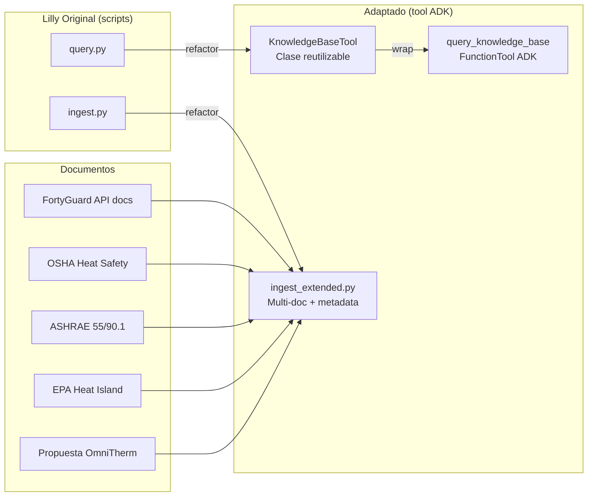

# Integración RAG - Adaptación del Trabajo de Lilly

## Contexto

Lilly creó un pipeline RAG funcional que ingiere el PDF de la propuesta OmniTherm, genera embeddings y permite consultas con Gemini. Este trabajo **sí nos sirve** y lo adaptamos como el tool `query_knowledge_base` del agente ADK, evitando código muerto.

## Lo que Existe Actualmente (Repo FortyGuard_26)

```
FortyGuard_26/
├── rag/
│   ├── ingest.py        # PDF → chunks → embeddings → ChromaDB
│   ├── query.py         # ChromaDB + Gemini → respuestas
│   └── test_gemini.py   # Test conexión Gemini
├── documents/
│   └── Propuesta_OmniTherm_AI_v2.pdf
├── chroma_db/           # Vector store persistente
└── requirements.txt/
    └── langchain.txt    # langchain, langchain-chroma, langchain-google-genai, pypdf, python-dotenv
```

## Análisis del Código Existente

### ingest.py (lo que hace)
- Usa `PyPDFLoader` para cargar el PDF
- `RecursiveCharacterTextSplitter` con `chunk_size=1000`, `chunk_overlap=200`
- Embeddings `sentence-transformers/all-MiniLM-L6-v2`
- Guarda en ChromaDB persistente

### query.py (lo que hace)
- Conexión ChromaDB + `similarity_search(k=4)`
- Modelo `gemini-3.6-flash` con `temperature=0`
- Prompt RAG básico (responde solo con contexto, "No encontré..." si no está)

### Limitaciones del Código Actual

| Problema | Impacto | Solución |
|----------|---------|----------|
| Código script (no importable) | No se puede usar como tool ADK | Refactor a clase `KnowledgeBaseTool` |
| Solo un PDF (la propuesta) | Conocimiento limitado | Ingestar docs técnicos adicionales |
| Embeddings locales MiniLM | Baja precisión técnica | Migrar a `text-embedding-004` (Gemini) |
| Sin metadata en chunks | No se puede filtrar por fuente | Agregar metadata (tipo doc, estándar) |
| `gemini-3.6-flash` (inexistente) | Error en runtime | Usar `gemini-2.0-flash` |
| Prompt sin contexto de negocio | Respuestas genéricas | Prompt especializado OmniTherm |

---

## Arquitectura de la Adaptación



---

## Implementación Adaptada

### 1. KnowledgeBaseTool (Clase Reutilizable)

```python
# app/agents/tools/knowledge_base.py
from typing import Dict, Optional
from pathlib import Path

from langchain_chroma import Chroma
from langchain_huggingface import HuggingFaceEmbeddings
from langchain_google_genai import ChatGoogleGenerativeAI

from app.config import settings


class KnowledgeBaseTool:
    """Tool de conocimiento para el agente ADK.

    Adaptación del trabajo de Lilly: refactoriza query.py a una clase
    reutilizable e importable, manteniendo el pipeline RAG original.
    """

    def __init__(
        self,
        chroma_path: Optional[str] = None,
        model_name: str = "gemini-2.0-flash",
        temperature: float = 0,
    ):
        self.chroma_path = Path(chroma_path or settings.CHROMA_PATH)
        self.embeddings = HuggingFaceEmbeddings(
            model_name="sentence-transformers/all-MiniLM-L6-v2"
        )
        self.vectorstore = Chroma(
            persist_directory=str(self.chroma_path),
            embedding_function=self.embeddings,
        )
        self.llm = ChatGoogleGenerativeAI(model=model_name, temperature=temperature)

    async def query(
        self,
        question: str,
        k: int = 4,
        filter_metadata: Optional[Dict] = None,
    ) -> Dict:
        """Consulta la base de conocimiento y retorna respuesta contextualizada."""
        docs = self.vectorstore.similarity_search(
            question,
            k=k,
            filter=filter_metadata,
        )
        context = "\n\n".join(d.page_content for d in docs)

        prompt = self._build_prompt(question, context)
        response = await self.llm.ainvoke(prompt)

        return {
            "question": question,
            "answer": response.content,
            "sources": [
                {"content": d.page_content[:200], "metadata": d.metadata}
                for d in docs
            ],
        }

    def _build_prompt(self, question: str, context: str) -> str:
        """Prompt especializado OmniTherm (mejora sobre el original de Lilly)."""
        return (
            "Eres el asistente técnico de OmniTherm AI, especializado en:\n"
            "- Inteligencia térmica (FortyGuard Temperature API, LTMs)\n"
            "- Protección industrial (riesgo calor, seguridad laboral)\n"
            "- Eficiencia energética en edificios (HVAC, ASHRAE, ROI)\n\n"
            "Responde usando ÚNICAMENTE la información del contexto.\n"
            "Si la información NO está en el contexto, responde:\n"
            '"No encontré esa información en la base de conocimiento de OmniTherm."\n\n'
            "Cita la fuente cuando sea posible.\n\n"
            f"CONTEXTO:\n{context}\n\n"
            f"PREGUNTA: {question}\n\n"
            "RESPUESTA TÉCNICA Y ACCIONABLE:\n"
        )


knowledge_tool = KnowledgeBaseTool()


async def query_knowledge_base(question: str, k: int = 4) -> dict:
    """Consulta la base de conocimiento (RAG) para normativas y best practices."""
    return await knowledge_tool.query(question, k=k)
```

### 2. Ingestión Extendida (Multi-Documento + Metadata)

```python
# app/rag/ingest_extended.py
"""Ingesta extendida: adaptación del ingest.py de Lilly.

Agrega: múltiples fuentes, metadata por documento, soporte PDF y texto plano.
"""
from pathlib import Path
from typing import List, Dict

from langchain_community.document_loaders import PyPDFLoader, TextLoader
from langchain_text_splitters import RecursiveCharacterTextSplitter
from langchain_huggingface import HuggingFaceEmbeddings
from langchain_chroma import Chroma

DOCUMENTS_CONFIG: List[Dict] = [
    {
        "path": "documents/Propuesta_OmniTherm_AI_v2.pdf",
        "metadata": {"source": "propuesta", "category": "negocio", "type": "pdf"},
    },
    {
        "path": "documents/fortyguard_api_docs.txt",
        "metadata": {"source": "fortyguard", "category": "api", "type": "txt"},
    },
    {
        "path": "documents/osha_heat_safety.txt",
        "metadata": {"source": "osha", "category": "normativa", "type": "txt"},
    },
    {
        "path": "documents/ashrae_55_90.txt",
        "metadata": {"source": "ashrae", "category": "estandar", "type": "txt"},
    },
    {
        "path": "documents/epa_heat_island.txt",
        "metadata": {"source": "epa", "category": "guia", "type": "txt"},
    },
]


def load_document(path: str, metadata: Dict) -> List:
    """Carga documento según tipo de archivo."""
    if path.endswith(".pdf"):
        loader = PyPDFLoader(path)
    else:
        loader = TextLoader(path)

    docs = loader.load()
    for doc in docs:
        doc.metadata.update(metadata)
    return docs


def ingest_all(chroma_path: str) -> None:
    """Ingesta todos los documentos configurados a ChromaDB."""
    embeddings = HuggingFaceEmbeddings(
        model_name="sentence-transformers/all-MiniLM-L6-v2"
    )
    splitter = RecursiveCharacterTextSplitter(chunk_size=1000, chunk_overlap=200)

    all_chunks = []
    for config in DOCUMENTS_CONFIG:
        path = config["path"]
        if not Path(path).exists():
            print(f"Saltando {path} (no existe)")
            continue

        docs = load_document(path, config["metadata"])
        chunks = splitter.split_documents(docs)
        all_chunks.extend(chunks)
        print(f"Cargado {path}: {len(chunks)} chunks")

    Chroma.from_documents(
        documents=all_chunks,
        embedding=embeddings,
        persist_directory=chroma_path,
    )
    print(f"Total chunks ingeridos: {len(all_chunks)}")


if __name__ == "__main__":
    ingest_all("chroma_db")
```

---

## Plan de Migración de Datos

| Paso | Acción | Resultado |
|------|--------|-----------|
| 1 | Mantener `chroma_db/` existente de Lilly | No perder embeddings ya generados |
| 2 | Refactor `query.py` → `KnowledgeBaseTool` | Tool importable para ADK |
| 3 | Refactor `ingest.py` → `ingest_extended.py` | Multi-doc + metadata |
| 4 | Ingestar docs técnicos adicionales | Conocimiento ampliado |
| 5 | Migrar embeddings → `text-embedding-004` | Mejor precisión (opcional, fase 2) |

## Documentos Adicionales a Ingestar (Value-Add Hackathon)

| Documento | Fuente | Por qué |
|-----------|--------|---------|
| FortyGuard API docs | docs-api.fortyguard.com | Agente conoce endpoints, parámetros, límites |
| OSHA Heat Illness Prevention | osha.gov | Worker Safety: normativa real citada |
| ASHRAE 55 / 90.1 | ashrae.org | HVAC setpoints, estándares eficiencia |
| EPA Heat Island Reduction | epa.gov | Cool roofs, pavements, tree canopy |

> **Sugerencia:** Estos docs se convierten a `.txt`/`.md` y se colocan en `documents/`. El RAG del agente puede citarlos en respuestas, lo que da credibilidad ante los jueces.

---

## Integración con el Agente ADK

```python
# app/agents/core.py (fragmento)
from google.adk import Agent
from app.agents.tools.knowledge_base import query_knowledge_base

omnitherm_agent = Agent(
    name="omnitherm_agent",
    model="gemini-2.0-flash",
    instruction=OMNITHERM_SYSTEM_PROMPT,
    tools=[
        # ... otros tools ...
        governed_tool(query_knowledge_base, AGENT_POLICY, audit_trail),
    ],
)
```

## Evitando Código Muerto

| Archivo Original | Destino | Estado |
|------------------|---------|--------|
| `rag/ingest.py` | `app/rag/ingest_extended.py` | Refactorizado + mejorado |
| `rag/query.py` | `app/agents/tools/knowledge_base.py` | Refactorizado + tool ADK |
| `rag/test_gemini.py` | `tests/unit/test_gemini.py` | Convertido a test formal |
| `documents/Propuesta_OmniTherm_AI_v2.pdf` | `documents/` (se mantiene) | Reutilizado |
| `chroma_db/` | `app/rag/chroma_db/` (o volumen) | Reutilizado |
| `requirements.txt/langchain.txt` | `pyproject.toml` | Consolidado |

> **Resultado:** Todo el trabajo de Lilly se reutiliza, nada queda como código muerto.
